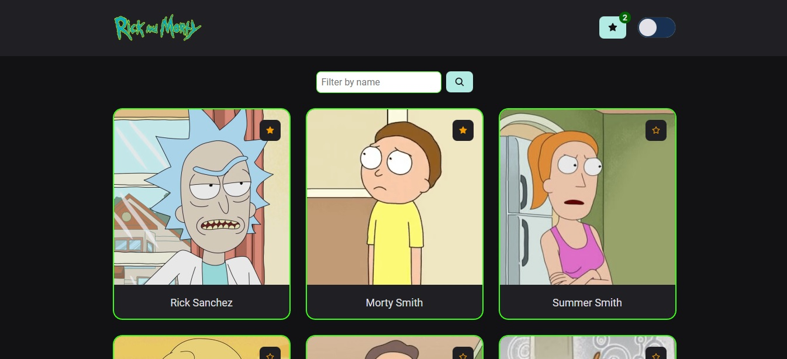

# Rick and Morty

This project is a repository of `Rick and Morty's characters`, using its [API](https://rickandmortyapi.com/documentation/#character).

Developed with `NextJS`, `Typescript` and `Styled-Components`.

Automated testing with `Jest`.

**Features:**
- Context API
- [Rick and Morty API](https://rickandmortyapi.com/documentation/#character)
- Axios
- SSG (Static Site Generator)

<p align=center>
  
</p>

### See the deploy [HERE](https://rick-and-morty-gui-leandro.vercel.app/)

## 💻 Run the project

```bash
# Install the dependencies
$ npm install

# Run the Jest tests
$ npm run test

# Run the application
$ npm run dev

# Open the project in browser at http://localhost:3000/
```

<h4 align=center>Developed by <a href="https://www.linkedin.com/in/guirdy/">Guilherme Leandro</a> 💻</h4>
